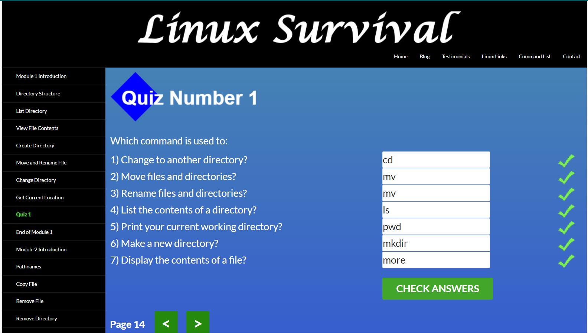

# Stage 0.

### General
:white_check_mark: 0. Git Basics :+1: 

Враження!

**З цього курсу дізнався багато нового і корисного, не думав що це настільки функціональна програма, коли просто продивився відео і повторив, здалося що це просто, але це було помилкове враження, повторити ще раз без підсказок важко :) Головне практика!**

___

## Linux CLI, and HTTP

:white_check_mark: 1. Linux CLI and Networking :+1:

Враження!

**Linux CLI, and HTTP - дуже цікава і важка тема для розуміння особливо HTTP дуже важко зрозуміти якщо ти не практикував, але все згодом і більше практикувати потрібно.**

___

- [ ] 2. VCS (hello gitty), GitHub and Collaboration

### Front-End Basics
- [ ] 3. Intro to HTML & CSS
- [ ] 4. Responsive Web Design
- [ ] 5. HTML & CSS Practice
- [ ] 6. JavaScript Basics
- [ ] 7. Document Object Model
 
### Advanced Topics
- [ ] 8. Building a Tiny JS World (pre-OOP)
- [ ] 9. Object oriented JS
- [ ] 10. OOP exercise
- [ ] 11. Offline Web Applications
- [ ] 12. Memory pair game
- [ ] 13. Website Performance Optimization
- [ ] 14. Friends App

